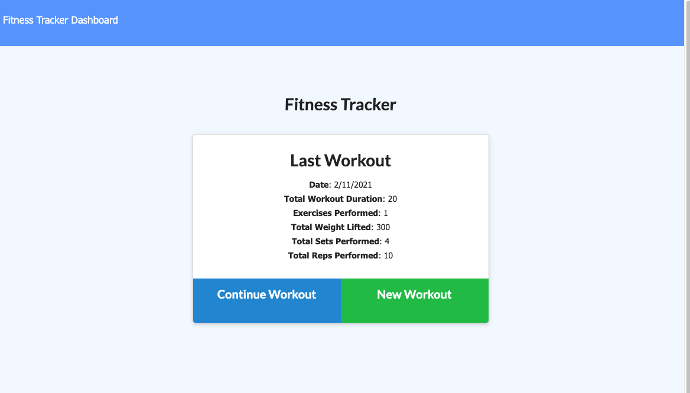

# Workout Tracker

## Description

This app allows users to track a workout and exercises. The workouts and exercises are saved in a mongo database.

App deployed to https://ad-fitness-tracker.herokuapp.com/

## Technologies used

- Node.js
- javascript
- mongoDB
- mongoose
- express
- heroku

## Use this project

In order to use this project

- Fork and clone the repo.
- Run a npm install for the dependencies
- Create mongo db
- In terminal run the command npm run seed to pre seed data into the application
- Then run npm start to begin the application
